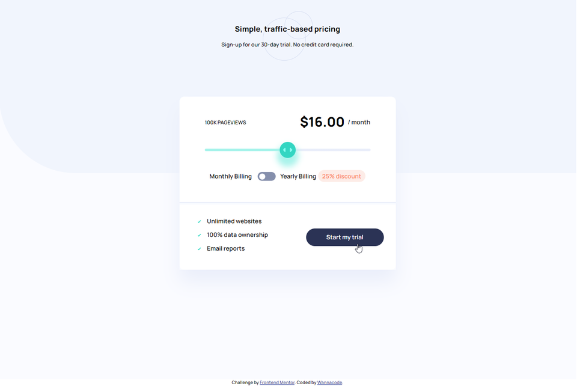
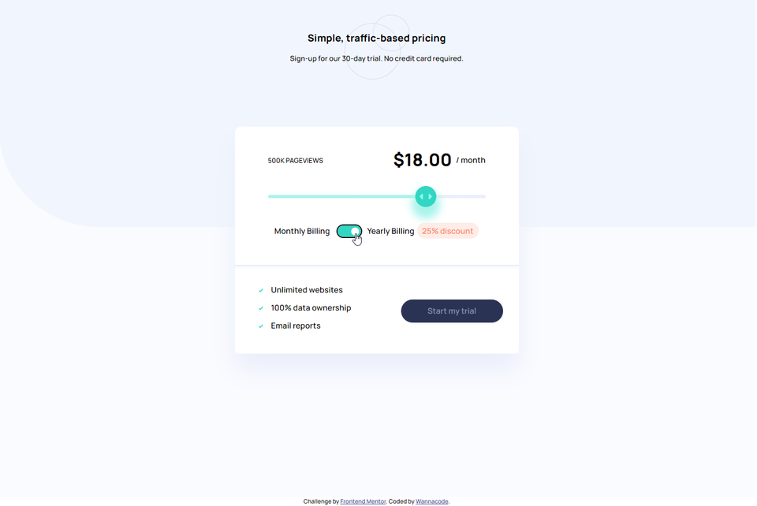

# Frontend Mentor - Interactive pricing component solution

This is a solution to the [Interactive pricing component challenge on Frontend Mentor](https://www.frontendmentor.io/challenges/interactive-pricing-component-t0m8PIyY8). Frontend Mentor challenges help you improve your coding skills by building realistic projects. 

## Table of contents

- [Overview](#overview)
  - [The challenge](#the-challenge)
  - [Screenshot](#screenshot)
  - [Links](#links)
- [My process](#my-process)
  - [Built with](#built-with)
  - [What I learned](#what-i-learned)
  - [Continued development](#continued-development)
  - [Useful resources](#useful-resources)
- [Author](#author)
- [Acknowledgments](#acknowledgments)

## Overview

### The challenge

Users should be able to:

- View the optimal layout for the app depending on their device's screen size
- See hover states for all interactive elements on the page
- Use the slider and toggle to see prices for different page view numbers

### Screenshot





### Links

- Solution URL: [Solution URL here](https://github.com/kwngptrl/FEM-interactive-pricing-component-main)
- Live Site URL: [Live site URL here](https://your-live-site-url.com)

## My process

### Built with

- Semantic HTML5 markup
- CSS custom properties
- Flexbox
- CSS Grid
- Mobile-first workflow
- Vanilla Javascript


### What I learned

Laying everything out was easy enough, but the CSS for the `<input type="range">` and the radiobutton toggle had me scratching my head for some time. Then, the accessibility made me think a bit. For the range slider, I looked around and found an example from [Creating a custom CSS range slider with JavaScript upgrades](https://blog.logrocket.com/creating-custom-css-range-slider-javascript-upgrades/), I dissected it and reworked it into the code. It included JS to apply the linear gradient on the slider track as the 'thumb' is moved about:
```js
rangeSlider.style.background = `linear-gradient(to right, var(--soft-cyan-full-slider-bar) ${progress}%, var(--neutral-light-grayish-blue) ${progress}%)`;
```

For the radiobutton toggle, I was thinking of light/dark mode I've read about. However, that uses a checkbox element and may not be for this particular challenge as described in this article ["Yes or No?" — One Checkbox vs Two Radio Buttons.](https://www.sarasoueidan.com/blog/one-checkbox-or-two-radio-buttons/). Then I found [Styling Radio Buttons with CSS (59 Custom Examples)](https://www.sliderrevolution.com/resources/styling-radio-buttons/), in particular this [Smile Toggle](https://codepen.io/CameronFitzwilliam/pen/RxYbgg).

Again, I dissected the code to try and understand it. I didn't need the animations of the original. I didn't want a ton of absolute positioning and values in pixels everywhere, so I used grid and flex box, and CSS variables to make it easier to resize the toggle. It's not perfect, if a different font is used the toggle's not going to be where it's supposed to be.

After getting the CSS working, it was time for the JS. It was pretty short and I just hardcoded values like 10,000 for 10K so any screenreader would read it naturally instead of 10K. If toggled, the 25% discount for a yearly (subscription) would have to be applied to the price per month. For accessibility, the range slider as it is moved about its track only announces zero, one, two... I figured that including aria-valuetext on it would give users more context as to what its current value is, therefore the JS code:

```js
rangeSlider.ariaValueText = `${pageViewPerMonth[tempSliderValue][2]} pageviews for ${pageViewPerMonth[tempSliderValue][1] * selectedBilling} dollars per month`;
```

Almost done? Not yet. I realized late that using the keyboard for navigation and tabbing about wouldn't land me anywhere near the radiobutton toggle! So I googled around and found the following article, [Inclusively Hiding & Styling Checkboxes and Radio Buttons](https://www.sarasoueidan.com/blog/inclusively-hiding-and-styling-checkboxes-and-radio-buttons/). I had to go back into the CSS, position the inputs close to where the 'thumb' is, raise their z-index, and then do `opacity: 0;`:
```css
input[type="radio"] {
    /* opacity:0 instead of display: none for accessibility */
    /* Article here: https://www.sarasoueidan.com/blog/inclusively-hiding-and-styling-checkboxes-and-radio-buttons/ */
    opacity: 0;
    z-index: 15;
}
```
One final thing, when tabbing about in the browser the color when an element is focused differs for Firefox and Chrome. I found a CSS Tricks article [Copy the Browser's Native Focus Styles](https://css-tricks.com/copy-the-browsers-native-focus-styles/) and incorporated that into my CSS, but I had to use `focus-within` as plain `focus` didn't work.
```css
.radio-btn-group:focus-within .pill-shape {
    background-color: var(--strong-cyan-slider-background);
    /* The next lines courtesy of https://css-tricks.com/copy-the-browsers-native-focus-styles/ */
    outline: 2px auto Highlight;
    outline: 2px solid -webkit-focus-ring-color;
}
```

Okay, that's about it. What I thought was simple wasn't so simple at all.

### Continued development

I don't know. It seems pretty complete. I'm going to look at how other people have done with this challenge.

### Useful resources

Resources are as mentioned in the [What I learned](#what-i-learned) above.

## Author

- Frontend Mentor - [@Wannacodee](https://www.frontendmentor.io/profile/kwngptrl)

## Acknowledgments

This is where you can give a hat tip to anyone who helped you out on this project. Perhaps you worked in a team or got some inspiration from someone else's solution. This is the perfect place to give them some credit.

**Note: Delete this note and edit this section's content as necessary. If you completed this challenge by yourself, feel free to delete this section entirely.**
